# 🚀 Azure Data Engineering Project (ADF + Databricks + SQL)

---

## 🧩 Problem Statement

In real-world systems, data is continuously generated and needs to be processed efficiently without reprocessing old data.

This project addresses:

* Dynamic data ingestion
* Incremental data processing
* Scalable pipeline design for analytics

---

## 🛠️ Tech Stack

* Azure Data Factory (ADF)
* Azure Databricks
* Azure SQL Database
* Azure Data Lake Storage (ADLS)
* GitHub (data source)

---

## 📌 Project Overview

This project demonstrates an end-to-end data engineering pipeline using Azure services.

### 🔹 Key Features

* Dynamic data ingestion from GitHub
* Incremental data loading using watermark logic
* Data processing and transformation
* Star schema data modeling for analytics

---

## 🏗️ Architecture Overview

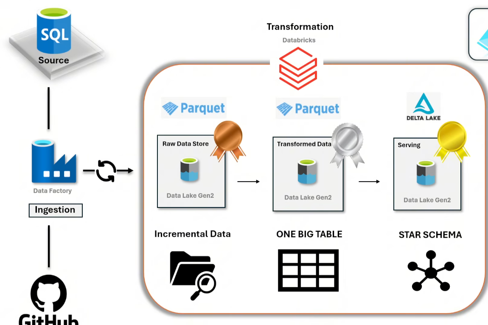

### 🔄 Flow

1. Data stored in GitHub (CSV files)
2. Azure Data Factory ingests data dynamically
3. Data loaded into Azure SQL Database
4. Incremental pipeline processes only new data
5. Databricks transforms data into Gold layer
6. Final data modeled using Star Schema

---

## 🔄 Pipeline 1: Source Preparation (GitHub → Azure SQL)

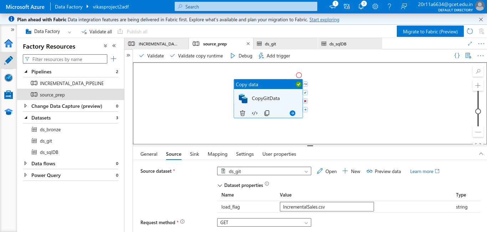

### 🎯 Objective

Load data dynamically from GitHub into Azure SQL Database.

---

### ⚙️ Implementation Details

#### 🔗 Linked Services

* Created Linked Service for GitHub (HTTP-based)
* Created Linked Service for Azure SQL Database

---

#### 📂 Dataset (GitHub - Parameterized)

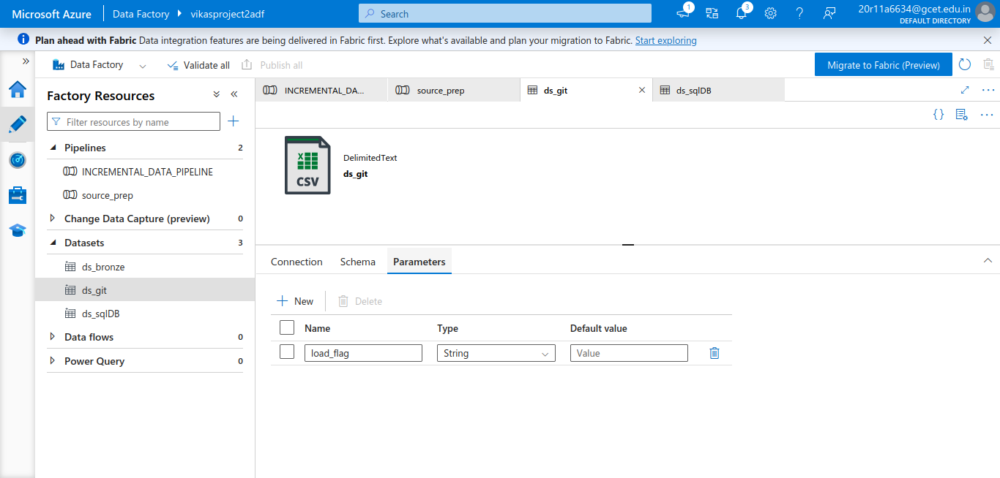
* Created dataset for GitHub CSV files
* Added parameter: `load_flag`
* Dynamically selects file name

---

#### 🔀 Dynamic File Path

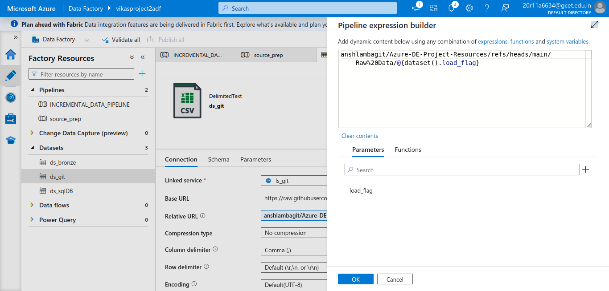

Used dynamic expression:

`@{dataset().load_flag}`

👉 This enables:

* First run → `SalesData.csv`
* Next run → `IncrementalSales.csv`

---

#### 🗄️ Sink Dataset (Azure SQL)

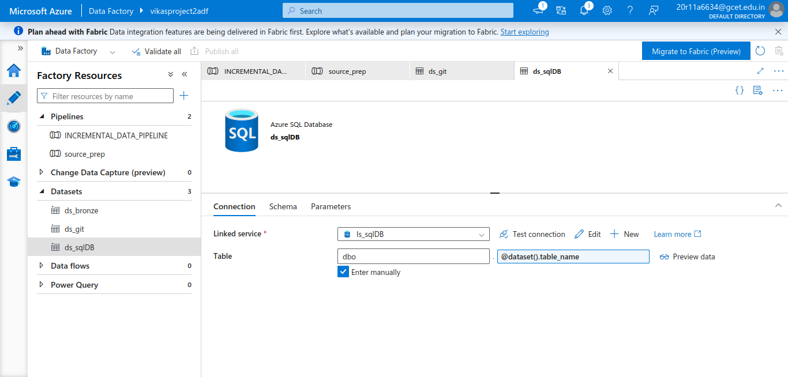

* Created dataset for SQL table
* Parameterized table name
* Supports dynamic loading

---

### ✅ Result

* Data is dynamically read from GitHub
* Loaded into Azure SQL Database
* No hardcoding of file names

---

## 🔄 Pipeline 2: Incremental Data Load (Watermark Logic)

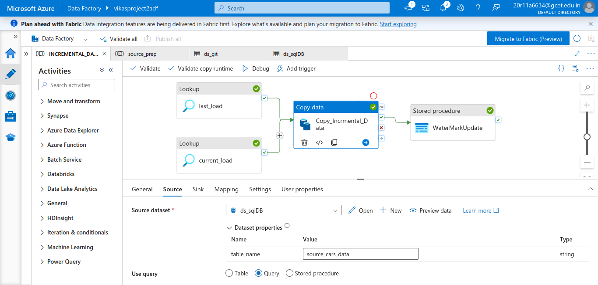

### 🎯 Objective

Load only new or updated data using incremental logic.

---

### 🔧 Step-by-Step Flow

---

### 🔍 1. Lookup – Last Processed Value

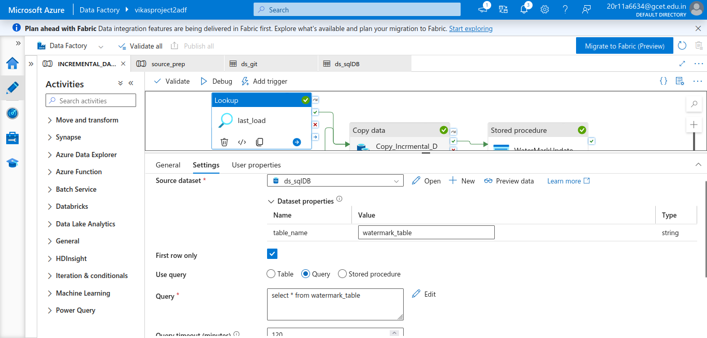

* Reads last processed value from watermark table
* Stored in `last_load`

---

### 🔍 2. Lookup – Current Maximum Value

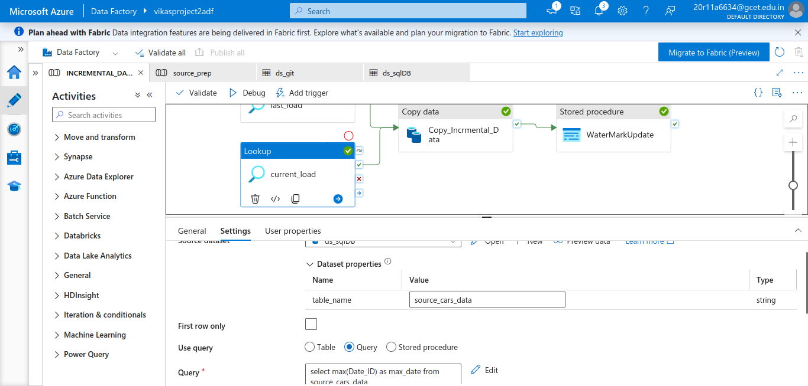

Fetches latest value from source table:

```sql
SELECT MAX(Date_ID) FROM source_cars_data
```

---

### 🔎 3. Dynamic Incremental Query

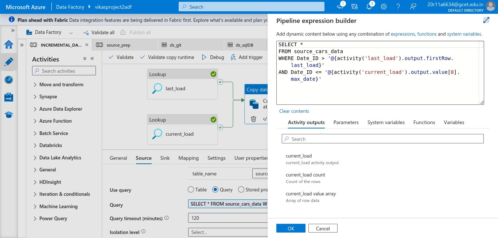

Filters only new data:

```sql
WHERE Date_ID > last_load  
AND Date_ID <= current_load
```

👉 Uses:

* `@activity('last_load')`
* `@activity('current_load')`

---

### 📥 4. Copy Activity

* Copies only filtered incremental records
* Loads data into target table

---

### 🔄 5. Watermark Update (Stored Procedure)

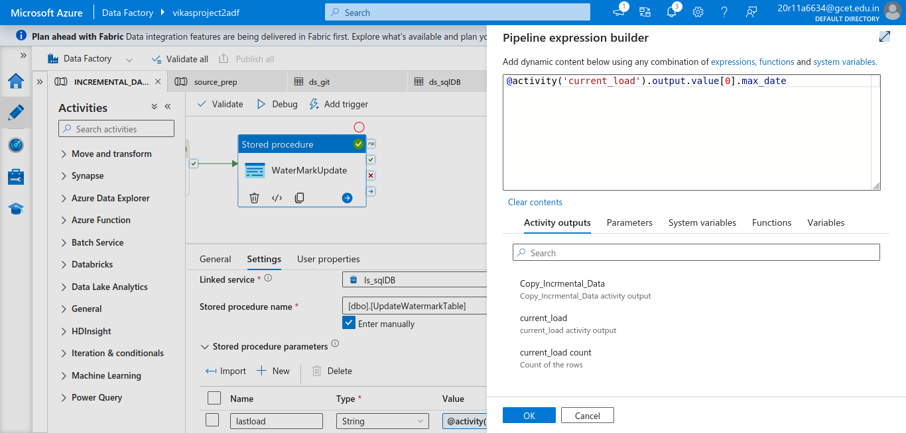

* Updates watermark table after load
* Uses dynamic value:

```
@activity('current_load').output.value[0].max_date
```

---

### ✅ Result

* Only new data is processed
* No duplicate loads
* Efficient pipeline execution

---

## 🧠 Key Concepts Implemented

* Parameterized pipelines
* Dynamic file ingestion
* Incremental data loading
* Watermark pattern
* Lookup activity usage
* Stored procedure integration

---

---

## ⚙️ Data Processing (Databricks)

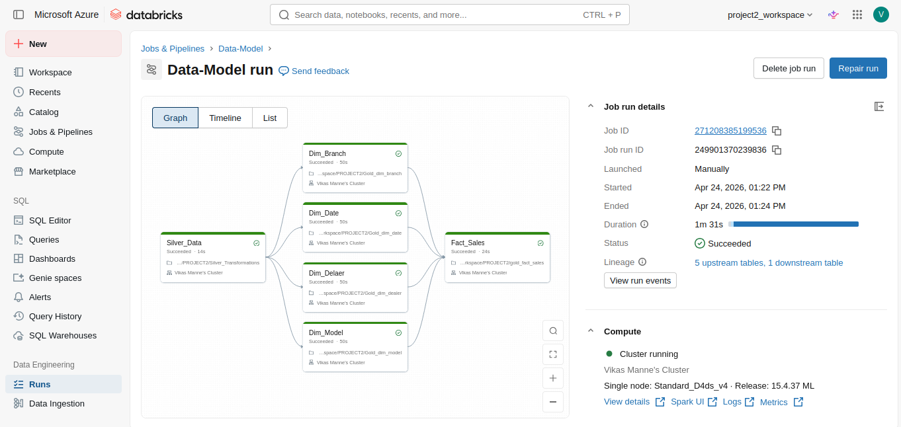

### 🧠 Workflow Overview
- Implements Bronze → Silver → Gold layered architecture
- Reads data from Azure SQL (ingested by ADF)
- Moves data into Bronze layer for processing 
- Performs data transformations using PySpark / SQL  
- Applies business logic and data cleansing  
- Loads processed data into Gold layer tables  
- Prepares data for analytics and reporting  

---

### 📓 Databricks Notebooks

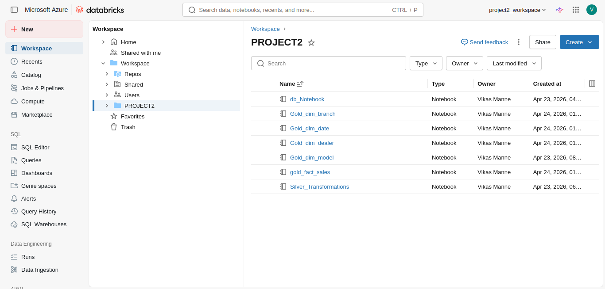

- Separate notebooks for each transformation layer  
- Silver layer handles cleaned and structured data  
- Gold layer contains final business-ready tables  

---

## 📊 Data Modeling (Star Schema)

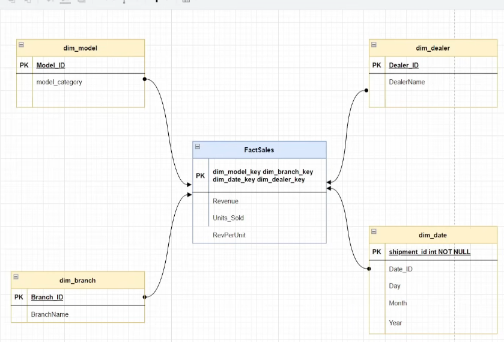

### Structure

#### Fact Table

* `FactSales`

  * Revenue
  * Units_Sold
  * RevPerUnit

#### Dimension Tables

* `dim_model`
* `dim_branch`
* `dim_dealer`
* `dim_date`

---

### Benefits

* Optimized for analytical queries
* Faster performance
* Clear business structure

---

## 💡 Key Highlights

* Fully dynamic pipeline (no hardcoding)
* Real-world incremental loading pattern
* End-to-end data engineering workflow
* Clean and scalable design

---

## 🎯 Conclusion

This project demonstrates practical implementation of modern data engineering concepts using Azure services, focusing on dynamic ingestion, incremental processing, and scalable data modeling.

---
